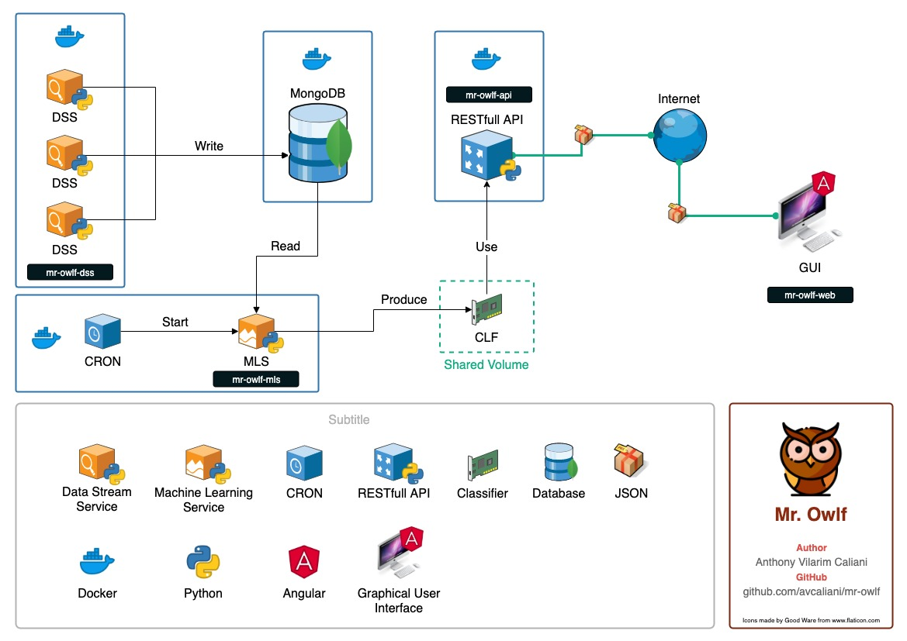

# 🦉 Mr. Owlf
By Anthony Vilarim Caliani

[](#)

## Description
**TODO**: Lorem ipsum dolor sit amet, consectetur adipiscing elit. Aenean sed purus at diam tincidunt ornare. Phasellus tincidunt dui eu augue malesuada rhoncus. Aliquam condimentum, orci a finibus vulputate, sapien ante pharetra ligula, sit amet tristique ante odio sed erat. Proin dictum metus et neque vehicula ornare.

## Quick Start

> Do I have a tip?

```bash
# TODO: Yeahhhhhh
whoami
````

## Projects

- 🌎 **[mr-owlf-api](mr-owlf-api/README.md)**: Mr. Owlf API
- 📦 **[mr-owlf-dss](mr-owlf-dss/README.md)**: Mr. Owlf Data Stream Services
- 🤖 **[mr-owlf-mls](mr-owlf-mls/README.md)**: Mr. Owlf Machine Learning Service
- 🕹 **[mr-owlf-web](mr-owlf-web/README.md)**: Mr. Owlf Web Application

## Architecture


---

_You can find [@avcaliani](#) at [GitHub](https://github.com/avcaliani) or [GitLab](https://gitlab.com/avcaliani)._