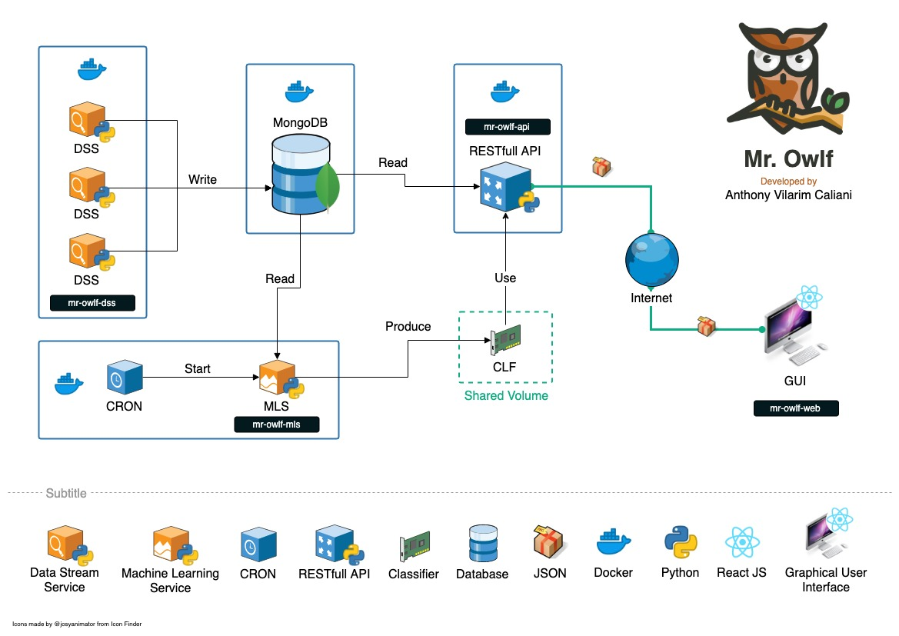
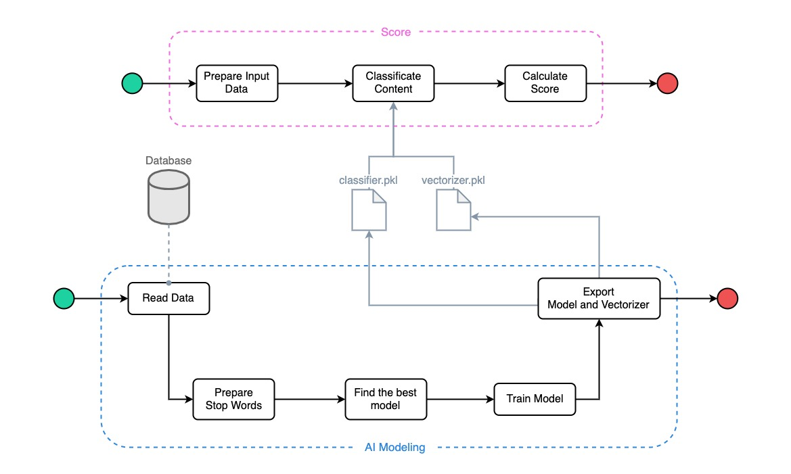

# 🦉 Mr. Owlf
By Anthony Vilarim Caliani

[](#)

### Before Starting...
I would like to thank everyone that has supported me to make it possible!
It was a very fun challenge and of course I've learned a lot!

Thank you very much guys!  

### And now! I introduce you **Mr. Owlf** 🦉
**Mr. Owlf** is a _Fake News_ detector concept and my M.B.A. conclusion project as well 😅

## Architecture


As you can see by the architecture **Mr. Owlf** has some components like _DSS_, _MLS_... And now we are going to understand them a little bit better.

### 📦 DSS
The **Data Stream Service** component is responsible for data ingestion and some statistics calculation. In this project we are going to use two pre-classified files, but the main idea here is to look foward adding more data sources like data streaming, web scraping and etc... By the way we can describe the project workflow by the image below.


### 🤖 MLS
The **Machine Learning Service** component is responsible for data classification and score building. This component is not only a service, It is a library as well and its workflow is described by the following image.



- **Service**: The "service" is represented by **"AI Modeling"** dashed box and it is part of the execution pipeline. It is important to say that this part will also generate our classifier and our vectorizer files to be used by "MLS" library later.
- **Library**: The "library" is represented by **"Score"** dashed box and it is used in _Mr. Owlf API_ for example. It means that you can import this library in your own _Python_ project, besides that this library is responsible for calculating data score and two of its inputs are provided by "MLS" service (classifier and vectorizer file).

### 🌎 API & Front-End
Both components, **API** and **Front-End** are being used to show that we can expose and consume our Fake News detector as a service.

Further information about these components can be found on [API Docs](mr-owlf-api/README.md) and [Front-End Docs](mr-owlf-front/README.md).


### 🧱 Projects

- 🌎 **[mr-owlf-api](mr-owlf-api/README.md)**: Mr. Owlf API
- 📦 **[mr-owlf-dss](mr-owlf-dss/README.md)**: Mr. Owlf Data Stream Services
- 🤖 **[mr-owlf-mls](mr-owlf-mls/README.md)**: Mr. Owlf Machine Learning Service
- 👨‍🔬 **[mr-owlf-poc](.doc/poc/mr-owlf-poc.ipynb)**: Mr. Owlf Proof of Concept
- 🕹 **[mr-owlf-web](mr-owlf-web/README.md)**: Mr. Owlf Web Application


## 🔥 The Hardest Part 🔥
Let's see how do we run this project...

```bash
# Ta dahh
./run.sh start

# When you finish...
./run.sh stop
````


---

_You can find [@avcaliani](#) at [GitHub](https://github.com/avcaliani) or [GitLab](https://gitlab.com/avcaliani)._
