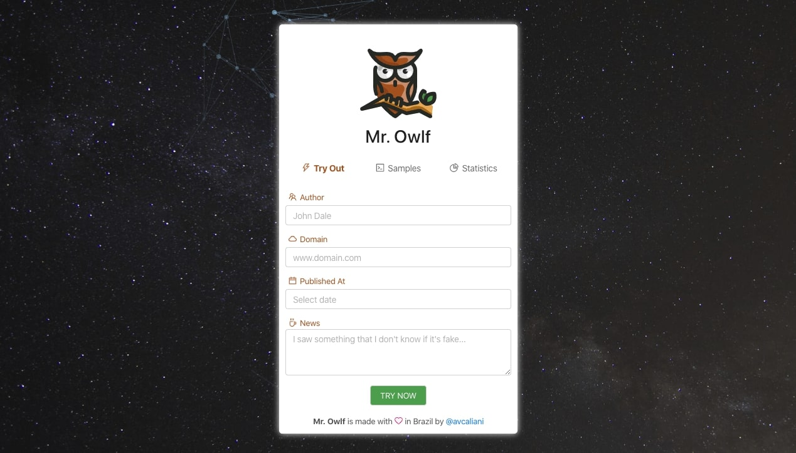

# 🕹 Mr. Owlf Front
By Anthony Vilarim Caliani

[](#) [](#)

## Running Locally

```bash
yarn        # Installing project dependencies
yarn start  # Starting our project
```

> This project was bootstrapped with [Create React App](https://github.com/facebook/create-react-app).

## Running on Docker
```bash
# Creating Docker Image
docker build -f DockerFile -t mr-owlf-front .

# Creating Docker Container
docker run -d \
	-p 80:80 \
	--name mr-owlf-front \
	mr-owlf-front
```

## Screenshot


---

_You can find [@avcaliani](#) at [GitHub](https://github.com/avcaliani) or [GitLab](https://gitlab.com/avcaliani)._